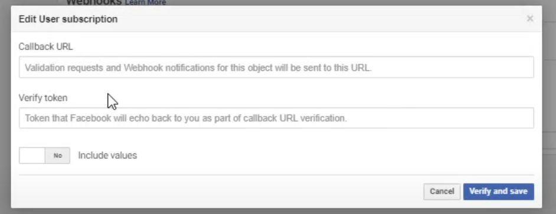
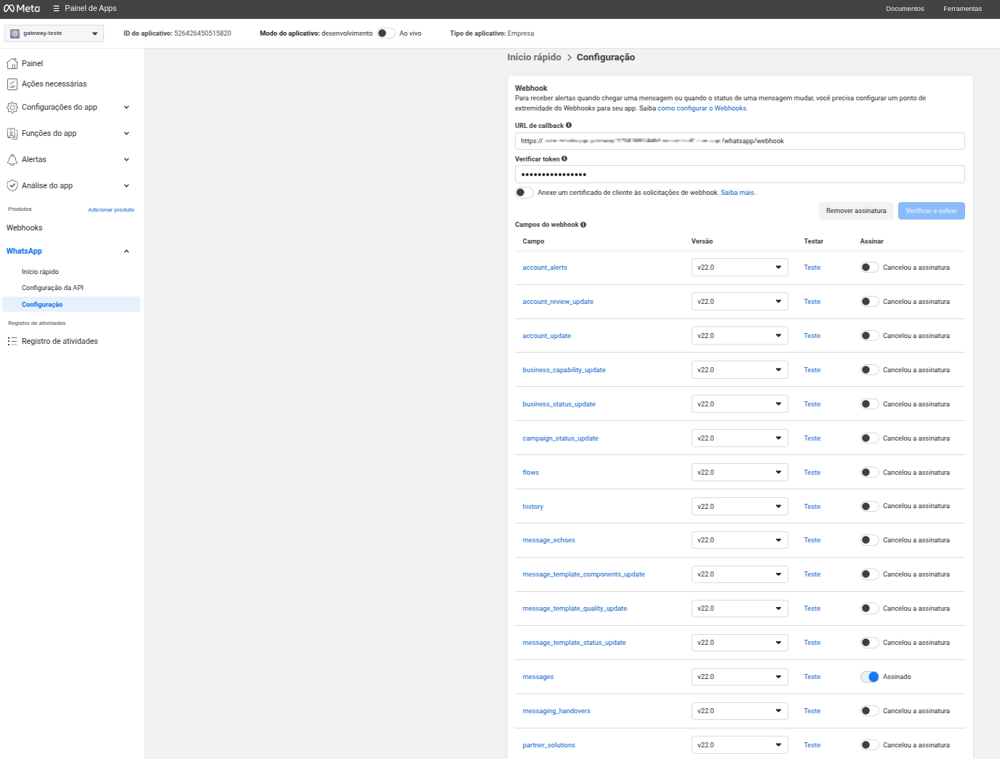

# 📘 Tutorial: Criando um Webhook API para WhatsApp Business conectado ao Dialogflow CX

## 🧠 Objetivo

Este notebook irá guiá-lo passo a passo na criação de uma API que funcionará como Webhook para o **WhatsApp Business**, utilizando a plataforma **Meta for Developers** e o framework **FastAPI**. A API terá como finalidade encaminhar as mensagens recebidas para o **Dialogflow CX**.

---

## ✅ Etapas

1. Criar um aplicativo no Meta for Developers  
2. Obter credenciais e configurar o WhatsApp Sandbox  
3. Criar a API Webhook com FastAPI  
4. Expor a API localmente com Ngrok (opcional para testes)  
5. Registrar o Webhook no painel da Meta  
6. Receber mensagens do WhatsApp e redirecionar para o Dialogflow CX  

---

## 🔧 Etapa 1: Criar um aplicativo no Meta for Developers

1. Acesse: [https://developers.facebook.com](https://developers.facebook.com)  
2. Faça login com sua conta do Facebook.  
3. No topo da tela, clique em **"Meus aplicativos" > Criar aplicativo**.  
4. Em "Qual o tipo do seu aplicativo?", selecione **Outro**.  
5. Escolha a opção **"Empresa"**.  
6. Preencha os dados solicitados:  
   - **Nome do aplicativo** (ex: `WebhookWhatsApp`)
   - **E-mail de contato**
   - **Conta do Business Manager** (se aplicável)  
7. Clique em **Criar aplicativo**.

---

## 🔐 Etapa 2: Adicionar o produto WhatsApp ao aplicativo

1. No painel do aplicativo, vá em **Adicionar Produto** e selecione **WhatsApp**, depois clique em **Configurar**.  
2. Será exibido o ambiente de sandbox com as seguintes informações:  
   - **Token de Acesso Temporário**  
   - **ID do número de telefone**  
   - **ID da conta do WhatsApp Business**  
   - **ID do aplicativo**  
3. Copie e salve essas informações em um local seguro.

> ⚠️ O token de acesso temporário expira em 24 horas. Para ambientes de produção, você deverá configurar um token permanente com as permissões apropriadas.

4. Adicione seu número pessoal de WhatsApp à lista de números aprovados para desenvolvimento.  
5. Envie uma mensagem para o número fornecido no sandbox, utilizando o comando `curl` sugerido na interface da Meta.


---

## 📣 Etapa 3: Configurar o Webhook

1. No menu lateral, vá até **Webhooks**.  
2. Clique em **"Adicionar URL de callback"**.  
3. Para configurar corretamente, você precisará de:
   - Uma **URL pública** onde sua API estará disponível (por exemplo, usando o **Cloud Run**, ou **Ngrok** para testes locais).
   - Um **Verify Token**, definido por você, que será usado para verificar o webhook na primeira requisição `GET`.

> ⚠️ O **Verify Token** é um segredo da sua aplicação, e **não** é o mesmo que o token de acesso da Meta.

4. Após a verificação com sucesso, selecione os eventos que o WhatsApp Business poderá enviar para sua aplicação.  
   Para o caso de uso da aplicação, selecione apenas o evento **messages** (mensagens).





---

## 💡 Preparação para a API

Antes de seguir para o código, certifique-se de ter os seguintes dados disponíveis:

- ✅ **Token de Acesso Temporário** (obtido na configuração do produto WhatsApp)  
- ✅ **ID do número de telefone** associado ao WhatsApp Business  
- ✅ **Verify Token** (definido por você, será usado para validar o webhook)

---

🎯 Com tudo isso pronto, podemos começar a desenvolver a **API com FastAPI** para receber mensagens do WhatsApp e redirecioná-las ao **Dialogflow CX**! 🚀


## 🧱 Estrutura da Aplicação e Arquitetura Utilizada

A aplicação foi desenvolvida utilizando o framework **FastAPI**, conhecido por sua alta performance e suporte nativo a tipagem com **Python moderno**.

O paradigma de programação do projeto é em **POO (Programação Orientada a Objetos)** e uma arquitetura dividida em camadas bem definidas, seguindo boas práticas de organização e separação de responsabilidades.

---

### 🔹 Camadas da Arquitetura

```bash
.
├── app/
│   ├── controllers/       # Define os endpoints da API
│   ├── services/          # Contém a lógica de negócio
│   ├── clients/           # Responsável pela comunicação externa com a API do WhatsApp Business
│   ├── models/            # Modelo de dados para representar o schema do request do whatsapp(tipagem, schemas)
│   └── main.py            # Inicialização da aplicação FastAPI e instanciação de objetos para injeção de dependência

```

## `Controllers`

Nesta camada estão os 2 endpoints da API onde ocorre a verificação do webhook da Meta (via GET) e do recebimento de mensagens (via POST).


```python
class WhatsAppController(BaseController):
    def __init__(self, whatsapp_service: WhatsAppService):
        super().__init__(prefix="/whatsapp")
        self.whatsapp_service = whatsapp_service

    def register_routes(self):
        self.router.add_api_route("/webhook", self.check_webhook, methods=["GET"])
        self.router.add_api_route("/webhook", self.handle_webhook, methods=["POST"])

    async def check_webhook(self, request: Request):
        """Verifica a URL do webhook do WhatsApp."""
        verify_token = os.getenv("META_WA_VERIFY_TOKEN")
        query_params = request.query_params

        if query_params.get("hub.verify_token") == verify_token:
            challenge = query_params.get("hub.challenge")
            return PlainTextResponse(content=challenge)

        raise HTTPException(status_code=status.HTTP_403_FORBIDDEN, detail="Token inválido.")

    async def handle_webhook(self, request: Request):
        """Recebe mensagens do WhatsApp e processa via service."""
        try:
            data = await request.json()

            entry = data.get("entry", [])[0]
            changes = entry.get("changes", [])[0]
            content = changes.get("value", {})

            if "contacts" in content and "messages" in content:
                response = await self.whatsapp_service.process_message(content)
                return Response(status_code=200)
            else:
                print("Payload inválido ou sem mensagens.")
                return JSONResponse(status_code=200, content={"status": "ok"})
            
        except Exception as e:
            print(f"Erro no webhook do WhatsApp: {e}")
            raise HTTPException(status_code=status.HTTP_500_INTERNAL_SERVER_ERROR, detail=str(e))

```


## `WhatsAppService`

A classe `WhatsAppService` é responsável por **processar as mensagens recebidas do WhatsApp Business** e encaminhá-las corretamente ao **Dialogflow CX**, tratando tanto mensagens de **texto** quanto de **áudio**.

Ela atua como o "cérebro" da aplicação, coordenando a comunicação entre:

- **WhatsAppClient** (responsável por enviar e receber mensagens da Meta),
- **DialogflowService** (responsável por interpretar a intenção do usuário e gerar uma resposta).


```python
class WhatsAppService:
    def __init__(self, whatsapp_client: WhatsAppClient, dialogflow_service: DialogflowService):
        self.whatsapp_client = whatsapp_client
        self.dialogflow_service = dialogflow_service

    async def process_message(self, data: Dict[str, Any]) -> Dict[str, str]:

        payload = WhatsAppPayload(**data)
        print(payload)
        if not payload or not payload.messages:
            logger.warning("Payload inválido ou sem mensagens: %s", data)
            return

        sender_id = payload.contacts[0].wa_id
        message = payload.messages[0]

        if message.type == "text":
            user_input = message.text.body
            response = await self.dialogflow_service.detect_intent_text(sender_id, user_input)
            return await self.whatsapp_client.send_message_text(sender_id, response)
            
        if message.type == "audio":
            audio_url = await self.whatsapp_client.get_media_url(message.audio.id)
            audio_bytes = await self.whatsapp_client.download_media(audio_url)
            
            converted_audio_bytes = AudioUtils.convert_whatsapp_audio_to_dialogflow(audio_bytes)
            audio_bytes = await self.dialogflow_service.detect_intent_audio(sender_id, converted_audio_bytes)

            audio_id = await self.whatsapp_client.upload_media_from_bytes(audio_bytes)
            response = await self.whatsapp_client.send_message_audio(sender_id, audio_id)
            
        logger.warning("Tipo de mensagem não suportado: %s", message.type)
```

